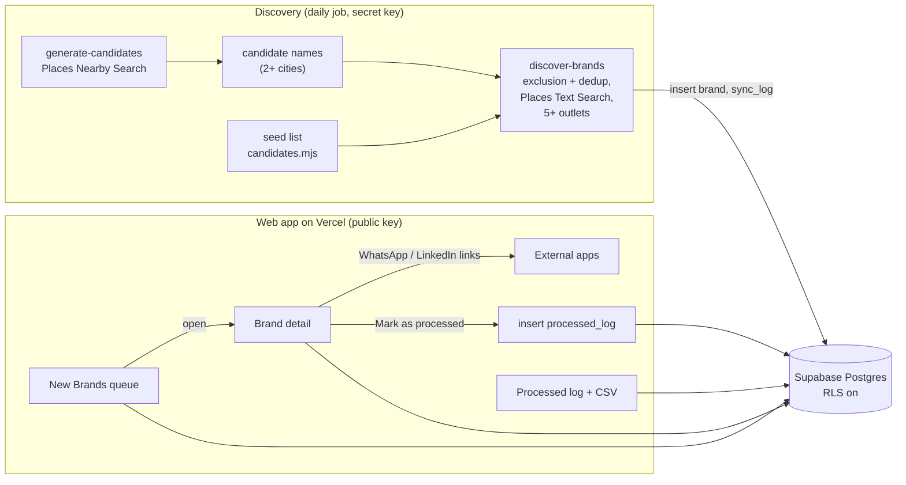

# Architecture — Outreach Radar

A daily prospecting queue for one SDR covering the food & beverage vertical in
India. Every day it surfaces up to 10 restaurant brands that match the ICP
(5+ outlets, any Indian city) and haven't been processed yet. The SDR opens a
brand to see outlets, POS, decision-makers and menu, reaches out over WhatsApp
or LinkedIn, and logs the brand as processed, after which it never resurfaces.

This document describes the system as it is built today, with planned work
marked as such. The source code is private; this repo is a public
overview — see the [README](README.md) for screenshots and the live demo.

## Contents

1. [Front end](#1-front-end)
2. [Data model](#2-data-model)
3. [Data acquisition](#3-data-acquisition)
4. [System overview and stack](#4-system-overview-and-stack)
5. [Security and access](#5-security-and-access)
6. [Roadmap](#6-roadmap)

---

## 1. Front end

Three screens in one shell: a dark sidebar and a light content area.

**New Brands (default view).** The sidebar shows *New Brands* with a live count
and *Processed* with its running total. The main panel opens with today's date,
a one-line explanation of the filter ("5+ outlets, any Indian city, filtered
against N brands already processed"), a "Brand data last synced …" timestamp,
search, and filters for outlets, city and POS. Below is a list of up to 10
brands: name, outlet count, cities, current POS ("Unknown" until known) and a
New badge. Clicking anywhere on a row opens the detail dialog.

**Brand detail dialog.** Two columns. Left: an account snapshot (total outlets,
current POS, cities, first seen) and decision-maker cards with a WhatsApp
button (a `wa.me/<number>?text=…` link with a pre-filled opener) and a LinkedIn
button (opens the stored profile URL). Right: a sample menu with prices and a
notes field. Footer: *Skip for now* (closes, no change) and *Mark as processed*
(the primary action).

**Processed.** A table of every brand reviewed: brand, outlets, date processed,
outcome pill, and assigned SDR, with search, an outcome filter and CSV export.

The rule that shapes the rest of the system: **"Mark as processed" is the only
action that changes state.** Everything else on the New Brands screen only
reads, so the daily queue is just "brands with no processed record", not a
complex sync.

---

## 2. Data model

Postgres on Supabase. One row per restaurant **brand**, not per outlet.

| Table | Columns | Notes |
|---|---|---|
| `brand` | id, name, slug, category, cities[], outlet_count, pos_vendor, icp_match, first_seen_at | `slug` is unique and is the dedup key for discovery inserts |
| `decision_maker` | id, brand_id, name, title, phone, whatsapp_number, linkedin_url, email | entered by hand today (see §3) |
| `menu_item` | id, brand_id, name, price, source, last_synced_at | sample data today |
| `processed_log` | id, brand_id, sdr_id, processed_at, outcome, notes | the append-only action log; `brand_id` is unique, so a brand can only be processed once |
| `sdr_user` | id, name, role | one seeded SDR, ready for more |
| `sync_log` | id, source, synced_at, candidates_tried, brands_found, quota_hit | one row per discovery run; drives the "last synced" header |

**Queue rule:** a brand appears in New Brands only if it has no row in
`processed_log`. The queue shows the 10 most recently seen of those.

**Identity:** discovery never relies on the raw name string. Names are
normalized to a sorted token set (lowercase, punctuation and filler words like
"pvt", "ltd", "india" removed) for matching against the exclusion list and
earlier runs, and to a `slug` for the database.

Not built yet: a separate `outlet` table (outlet_count is a single number from
discovery), and a `seen_at` marker for brands shown but not yet opened.

---

## 3. Data acquisition

All discovery runs against the **Google Places API (New)**, an official,
terms-compliant API. Nothing scrapes aggregator sites (Zomato, Swiggy) or
LinkedIn. Scraping either at volume is a real legal exposure, and building on a
compliant API keeps the project something that can be demoed and described
publicly. Swapping in a licensed restaurant-data provider later would change the
connector, not the architecture.

Discovery is two Node.js scripts in `scripts/`. Both keep their state in the
gitignored `scripts/data/` folder, so every run continues from the last one.

### Step 1 — find candidate names (`npm run generate`)

`generate-candidates.mjs` uses **Places Nearby Search**, a separate quota from
step 2. Nearby Search returns the same top 20 for the same query, so the script
walks a fixed rotation of 1,200 searches:

> 12 place types (fast food, cafe, bakery, Indian, pizza, Chinese, ice cream,
> coffee, sandwich, burger, dessert, restaurant) × 5 areas per city (centre and
> four points ~6 km out, 4 km radius) × 20 Indian cities

Each run takes the next 40 searches and saves its position. Every name seen is
recorded with the cities it was seen in, across runs. A name seen in **2+
cities** is a cheap chain signal that costs no extra quota, so it becomes a
candidate, unless it is already known, already tried, or on the exclusion list.

A hand-curated seed list (`scripts/candidates.mjs`, ~140 chains) is the other
source of candidates.

### Step 2 — verify against the ICP (`npm run discover`)

`discover-brands.mjs` reads the database first, so a bad key or schema fails
before spending quota. It then filters out, without any API call:

- names on the private exclusion list (`scripts/data/excluded-brands.txt`,
  existing customers and brands that should never be suggested), matched on
  whole normalized words so a short name can't accidentally match inside a longer one;
- brands already processed or already in the `brand` table;
- names tried in an earlier run.

For each remaining candidate it runs **Places Text Search** (paging through
results), keeps places in India, and counts outlets and cities. A brand with
**5+ outlets** is an ICP match and is inserted into `brand`. Every run, even
one that finds nothing, writes a `sync_log` row. If Google returns a quota
error (HTTP 429) the run stops cleanly and the next run resumes where it left off.

Known limitation: the 2+ city test lets through common names that aren't one
chain (for example "Lucky Restaurant"). A stricter test (3+ cities, or checking
that outlets share a website) is on the roadmap.

### POS, decision-makers and menus

- **POS:** there is no public "which POS does this restaurant use" API. It
  stays "Unknown" until the SDR learns it on a call. Possible later signals:
  ordering widgets on the brand's site, or job postings that name a POS.
- **Decision-makers:** entered by hand. Scraping LinkedIn violates its terms,
  so automated enrichment would go through a licensed provider (Apollo, Lusha,
  or LinkedIn's partner APIs). The demo's contacts are fictional sample data.
- **Menus:** sample data today. Menus are public marketing content, so a later
  connector could read brands' own online-ordering menus within robots.txt and
  rate limits.

---

## 4. System overview and stack

| Layer | Choice | Why |
|---|---|---|
| Front end | Next.js 16 (App Router), React 19, TypeScript, Tailwind CSS 4, Motion | matches the mockup's component structure; deploys on Vercel |
| Data access | `@supabase/supabase-js` from the browser with the public key | no API layer to run; Row Level Security decides what the public key may do |
| Database | Supabase (Postgres + RLS) | relational data (brand → decision-makers, menu, processed log) with built-in Auth for later |
| Discovery | Node.js scripts using the Places API (New), writing with the server-only secret key | slow, quota-bound work stays out of the page request path |
| Scheduling | a daily scheduled run on the maintainer's machine (generate, then discover) | simple for one SDR; could move to a GitHub Action or Supabase scheduled function |
| WhatsApp | `wa.me` deep links | no API needed until the app sends and tracks messages itself |
| LinkedIn | plain links to stored profile URLs | no automation, so no terms-of-service risk |
| Hosting | Vercel (app), Supabase (database) | |

---

## 5. Security and access

**Keys.** The web app only ever has the Supabase URL and the public key. The
Supabase secret key (bypasses RLS) and the Google Places key live only in
`.env.local` on the machine that runs discovery. They are never committed,
never set in Vercel, and never given a `NEXT_PUBLIC_` prefix. Legacy JWT-style
Supabase keys are disabled on the project.

**Row Level Security.** The demo is public with no login, so its policies allow
anonymous reads and processed-log writes. Brands, contacts and menus can only be
written with the secret key, and nothing can be deleted through the public key.
This is deliberately loose for a demo with sample data, and must be tightened
before real contact details go in:

1. Supabase Auth, one login per `sdr_user`.
2. Contacts and the processed log readable and writable only by signed-in SDRs.
3. `processed_log.sdr_id` set from the signed-in user, not from the client.

---

## 6. Roadmap

| Phase | Scope | Status |
|---|---|---|
| 0 — Schema and shell | Six tables, three screens against seed data | Done |
| 1 — Real writes | "Mark as processed" writes to Postgres; queue excludes processed brands | Done |
| 2 — Automated discovery | Places-based generator + ICP verification, dedup, quota-safe resume, sync log, daily run | Done |
| 3 — Enrichment | POS signals, menus, decision-makers through a licensed provider; stricter chain test | Next |
| 4 — Auth and polish | Supabase Auth with per-SDR RLS, multi-SDR assignment, editable outcomes, weekly throughput view, optional WhatsApp Business API | Planned |

## Design note: objects, actions, audit trail

Brands, decision-makers and menu items are objects with relationships, and
"Mark as processed" is an **action** that moves a brand to a new state and
writes an **audit record** (who, when, outcome, notes) as its own row instead of
changing a field on the brand. That's the same shape used in ontology-style
modeling, built here as an ordinary relational app.
